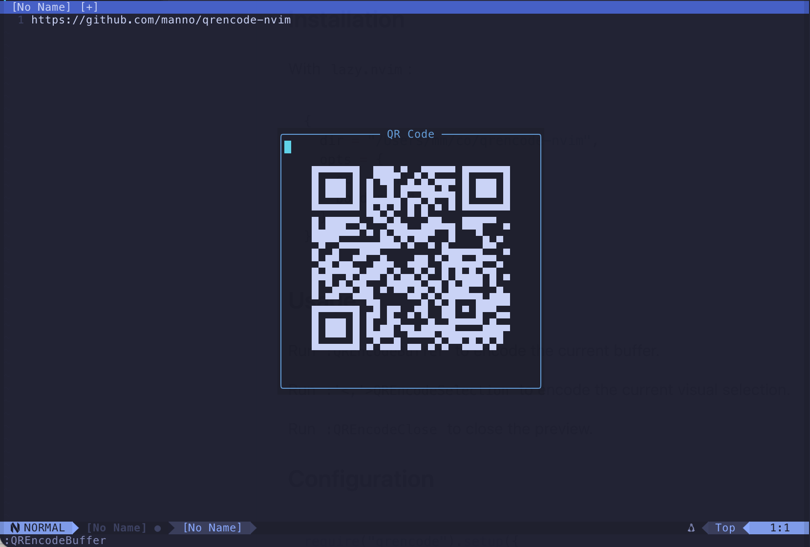

# qrencode-nvim

Generate QR codes from Neovim buffer text or a visual selection using pure Lua, then display the result inside Neovim.



## Features

- Pure-Lua QR generation at runtime
- Unicode block rendering directly inside Neovim
- Commands for whole-buffer and visual-selection encoding

## Requirements

- Neovim

## Installation

With `lazy.nvim`:

```lua
{
  "manno/qrencode-nvim",
  opts = {
    ecl = "M",
    border = 4,
  },
}
```

## Usage

Run `:QREncodeBuffer` to encode the current buffer.

Run `:'<,'>QREncodeSelection` to encode the current visual selection.

Run `:QREncodeClose` to close the preview.

## Configuration

```lua
require("qrencode").setup({
  ecl = "M", -- one of: L, M, Q, H
  border = 4,
})
```
